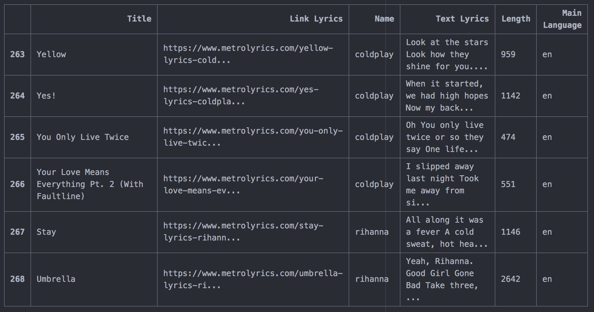

# Lyrics_classifier:
Web scraping, database creation, training and prediction

## Introduction:

Web scraping, is data scraping used for extracting data from websites using its HTML structure.
In this project, I used BeautifulSoup python package in order to automatically extract all lyrics from artists
at [https://metrolyrics.com](https://metrolyrics.com), to then build an artist's classifier to predict the
artist on new text. The program works in three modes: The scraping mode, the training mode and the prediction mode
which are described in the next sections.

## Requirements

'''
* spacy 2.2.1
* sklearn 0.21.3
* pandas 0.23.4
* langdetect 1.0.7
* googletrans 2.4.0
* beautifulsoup 4.6.5
'''

## Scraping web data

## Training

## Prediction

## How to use:
